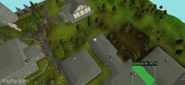

# Monkey Agility
Named after the saying; Monkey see, Monkey do.

This is a system to run obstacle course laps in [online video game], and it consists of two components:

## Monkey See:
------
A machine vision model to interpret the [online video game]'s environment. The model is from [Detectron2](https://github.com/facebookresearch/detectron2).
It was trained on [this notebook](https://colab.research.google.com/drive/16jcaJoc6bCFAQ96jDe2HwtXj7BMD_-m5) using a manually collected and annotated set of in game screenshots.

This model detects the agility course's obstacle regions and outputs x-y coordinates of said obstacles.

## Monkey do:
-------
This component takes the output of the machine vision model and then interacts with the in game environment. This is achieved by moving the mouse pointer and clicking the agility obstacles.

The train and val data sets and the model are not currently uploaded
