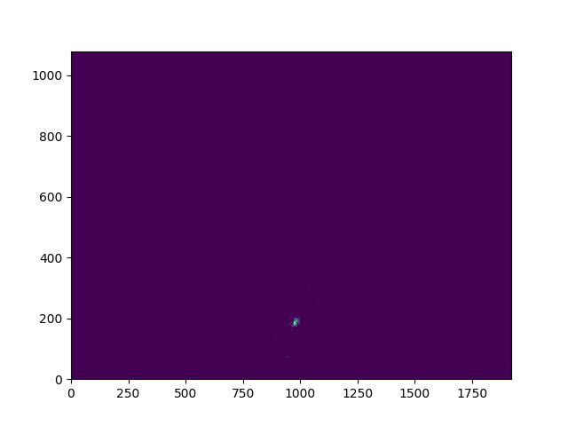
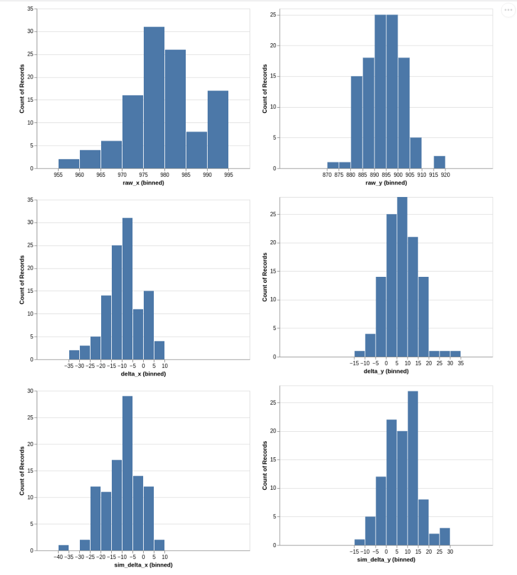

# Analysis of distribution of clicks from center of click location

## Recording Mouse Clicks
Run `record_clicks.py` to generate the sample of clicks. The first click records the center of the clicking region. The second click is the leftmost edge, third is the right most. Fourth click is the bottom, and the fifth click is the top of the region. Subsequent clicks are used to create the distribution. Then record points and then right click to save and exit.

## Click Heat Map
Run `click_heatmap.py` to create and save a heat map of my clicks for one agility obstacle. The corners of the obstacle are shown  


## Analyse Mouse Clicks
Run `analyise_clicks.py` to calculate distribution parameters and display the following chart

## Distribution of clicks



I have a bias of clicking high and to the left, so this will be included the interaction component

```
x mean: -9.981818181818182, x std: 8.404524558703558
y mean: 6.572727272727272, y std: 7.741809855241263
```